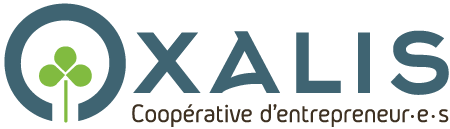

---

## En Bref

* **1989** – Naissance
* **2013** – Fin de mes études et début de mon activité indépendante
* **2019** – entrée en coopérative d'activité et d'emploi

<a class="bouton" href="a-propos/CV-Margot-Nadot.pdf">CV</a> — <a class="bouton" href="https://magnad.blog/">Blog</a> — <a class="bouton" href="https://www.linkedin.com/in/margotnadot/">Page Linkedin</a>

---

## Mobile

Après avoir grandi dans le **Val-de-Marne**, en plus ou moins lointaine banlieue parisienne, j’ai étudié à **Paris** (ESAIG Estienne), en **Bretagne** (IUT de Lannion), puis à Annecy (Gobelins) en **Haute-Savoie** où j’ai commencé à travailler et habité 7 ans. Après une année à Lyon, une année à Quimper, et une année dans une lointaine campagne d’**Irlande** (dans le Donegal), me voici basée à Nevers en **Bourgogne**.

Parmi les plaisirs liées à mon statut d’indépendante, il y a celui de pouvoir travailler de partout, ce qui me permet d’aller longuement visiter ma famille, mes ami·es, collègues et client·es tout au long de l’année.

---

## Polyvalente

Mes études ont été très professionnalisantes mais dans des domaines différents : <strong class="est-surligne">illustration</strong>, <strong class="est-surligne">journalisme</strong>, <strong class="est-surligne">web</strong>. Elles m'ont permis de mettre de nombreuses cordes à mon arc, que je complète au gré de mes missions et formation : développement, animation, gouvernance partagée, transformation de conflits...

Aujourd’hui, je suis capable de : 
* <strong class="est-surligne">Concevoir une communication</strong>, grâce à la compréhension rapide que j’acquière de son public ; 
* <strong class="est-surligne">Réaliser des supports de com</strong> beaux, originaux, efficaces et variés : illustration, site web, brochures, vidéos, infographies, articles...

---

## Curieuse

Mon métier me permet de mieux comprendre la société dans laquelle je vie : chaque mission commence par une enquête et représente une occasion en or de me plonger dans des univers très différents :
* **des vergers citoyens**  (Clamecy 2021)
* **le problème des passoires énergétiques**  (La Copro des Possibles, 2019-2022)
* **l’accès à l’emploi**  (#JeNeSuisPASunCV 2018, 2021-22, ProfilScan 2021)
* **la relation entre un Parc Naturel Régional  et ses habitant·es**  (Morvan 2022),
* **la recherche en astrophysique**  (le LAPP 2018)

---

## Coopératrice en CAE

En tant qu’indépendante, j’ai la chance d’évoluer dans une <strong class="est-surligne">Coopérative d’Activité et d’Emploi</strong> fantastique qui me permet de travailler la question de la protection sociale des indépendant·es, d’avoir des collègues et de vivre des temps collectifs terriblement jouissifs et passionnants.

La mienne s’appelle Oxalis, c’est une entreprise mutualisée par 250 travailleureuses autonomes qui se cotisent donc pour se payer un service comptable, de l’accompagnement, et tellement d’autres choses…

Participer à Oxalis fait partie de [ma façon de m'engager](../engagement). Je suis actuellement élue au conseil d'administration.

<a class="bouton" href="https://oxalis-scop.fr/">Découvrir Oxalis</a>

---

